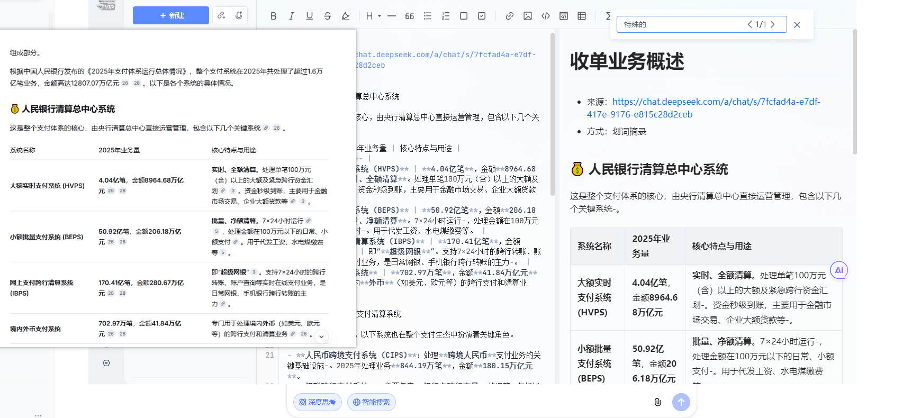

# 干净摘录 · CleanMD

<p align="center">
  
</p>

<p align="center">
  <strong>AI 对话一键导出 Markdown</strong><br />
  DeepSeek · 豆包 · 通义千问 · 划词 / 区域通吃其它站
</p>

<p align="center">
  
  
  
  
  
</p>

**干净摘录（CleanMD）** 是一款 Chrome 扩展（Manifest V3），专为把 **AI 聊天页** 和普通网页整理成干净 Markdown 而做。

在 DeepSeek、豆包、通义千问等对话页点 **摘录本页**，会按轮次导出用户 / 助手消息（尽量跳过思考链噪声、处理虚拟列表滚动），得到可收藏、可传阅、可再喂给其它模型的上下文。ChatGPT 等其它 AI 站可用 **划词浮标** 或 **区域摘录** 快速导出选中段落。

未登录可无限摘录。登录 [闲算](https://www.xiansuan.top) 后自动同步云端历史，并支持口令/链接「传阅」。
<p align="center">
  
</p>
---

## AI 对话摘录（重点）

| 站点 | 适配方式 | 说明 |
| --- | --- | --- |
| **DeepSeek**（chat.deepseek.com） | 专用 | 多轮对话 → Markdown；跳过思考区；长会话可滚动收集虚拟列表 |
| **豆包**（doubao.com） | 专用 | 多轮消息按角色整理为 Markdown |
| **通义千问**（chat.qwen.ai 等） | 专用 | 多轮对话导出，适配千问 / 通义页面结构 |
| **ChatGPT / Claude / 其它 AI 站** | 划词 / 区域 | 选中一段点浮标，或用区域摘录框选对话块 |

典型用法：

1. 打开 DeepSeek / 豆包 / 千问对话页 → 弹窗 **摘录本页** → 得到完整对话 Markdown  
2. 只要其中几段：划选文字 → 点光标右下角剪刀图标  
3. 结构难选时：弹窗 **区域摘录** → 锁定对话区域 → 确认  

---

## 其它能力

| 能力 | 说明 |
| --- | --- |
| **划词浮标** | 任意页面划选后，图标出现在鼠标右下角，一点复制 Markdown |
| **区域摘录** | 悬停锁定 DOM 区块，可扩大/缩小后确认 |
| **文章站** | 知乎、CSDN、GitHub 等正文规则抽取 |
| **云端历史** | 登录后自动保存，弹窗「历史」可打开/复制/删除 |
| **传阅** | 生成口令/链接，或发给已注册闲算用户 |
| **反馈** | 某 AI 站翻车可一键提交，便于补适配 |

## 站点一览

**AI 对话（专用）**

- DeepSeek Chat  
- 豆包  
- 通义千问 / 通义  

**内容站**

- 知乎（回答 / 专栏 / 问题）  
- CSDN 文章  
- GitHub（README / 文件 / Issue 等）  

**通用**

- 其它页面（含 ChatGPT 等）：划词浮标 + 区域摘录 + 正文启发式  

## 安装（开发者模式）

1. 打开 Chrome → `chrome://extensions`
2. 开启 **开发者模式**
3. **加载已解压的扩展程序** → 选择本目录 `clean-clip`
4. 工具栏固定「干净摘录」图标

修改代码后需在扩展页点击 **重新加载**；改了 content script 请刷新目标网页。

## 使用

1. **AI 整页对话**：在 DeepSeek / 豆包 / 千问打开弹窗 → **摘录本页**
2. **划词**：任意页选中文字 → 点浮出的剪刀图标
3. **区域**：弹窗 → **区域摘录** → 锁定 → 扩大/缩小 → 确认
4. **账号**（可选）：弹窗「账号」登录闲算 → `https://www.xiansuan.top`

## 目录结构

```
clean-clip/
├── manifest.json
├── README.md
├── ABOUT.md                 # GitHub About 填写参考
├── icons/
├── lib/
│   ├── html2md.js
│   ├── api.js
│   └── storage.js
├── content/
│   ├── ai-chat.js           # DeepSeek / 豆包 / 千问对话摘录
│   ├── selection-bubble.js  # 划词浮标
│   ├── region-select.js
│   ├── clip.js
│   └── sites-cn.js
└── popup/
```

## 权限说明

| 权限 | 用途 |
| --- | --- |
| `activeTab` / `scripting` | 在当前页（含 AI 站）注入摘录脚本 |
| `clipboardWrite` | 复制 Markdown |
| `storage` | 会话、上次结果、API 地址 |
| `host_permissions` | 任意 http(s) 页摘录；请求闲算 API |

## 与闲算的关系

扩展可独立使用。登录后：

- 云端历史 `/api/clip/history/*`
- 传阅 `/api/public/clip/share/*`、`/api/clip/share/*`
- 反馈 `/api/public/clip/feedback`

自建服务端时，在弹窗「账号」修改 **API 地址**。

## 开发提示

- AI 适配逻辑在 `content/ai-chat.js`；DeepSeek 长会话可能短暂滚动以收集虚拟列表
- 划词浮标在 `document_idle` 注入，改完需刷新页面
- HTML → MD：`lib/html2md.js`

## 反馈

某 AI 站摘录翻车或不适配：弹窗「反馈」提交。

官网：<https://www.xiansuan.top>
